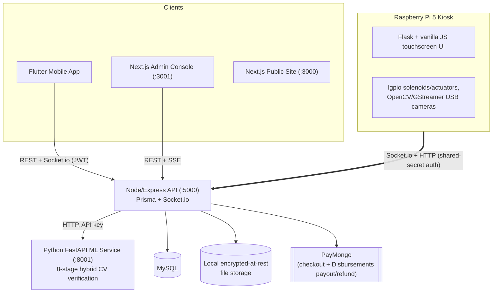

# EngiRent Hub

**A smart kiosk for secure student-to-student item rentals at UCLM's College of Engineering.**

[](LICENSE)
[](server/node_server)
[](server/python_server/services/ml)
[](client/flutter_app)
[](client/admin)

[Overview](#overview) • [What it actually does](#what-it-actually-does) • [Architecture](#architecture) • [Repo structure](#repo-structure) • [Getting started](#getting-started) • [Documentation](#documentation) • [Status & known limitations](#status--known-limitations) • [Team](#team)

---

## Overview

EngiRent Hub is a thesis project at the University of Cebu Lapu-Lapu and Mandaue (UCLM), College of Engineering: a physical locker kiosk plus a mobile app and admin console that let engineering students list, rent, and return equipment (lab gowns, scientific calculators, Arduino kits, power banks, and more) without a human attendant. Items are dropped off and picked up through solenoid-locked lockers; a camera captures images at each checkpoint; a purpose-built computer-vision pipeline compares those images against the item's listing photos to confirm nothing was swapped or damaged; face verification — done in the mobile app, on the user's own phone, not at the kiosk — gates locker access; payment runs through PayMongo.

This README describes the system **as it is verified to actually work today**, cross-checked file-by-file against the real code — not a product pitch. For the full technical audit behind every claim here, see [`docs/audit/documentation.md`](docs/audit/documentation.md).

### Academic context

- **Institution:** University of Cebu Lapu-Lapu and Mandaue (UCLM)
- **Department:** College of Engineering
- **Program:** Bachelor of Science in Computer Engineering
- **Thesis Adviser:** Engr. Diego V. Abad Jr.

### Why this exists

A 31-student engineering survey found real, recurring friction in peer-to-peer campus borrowing: lab gowns (77.4% need), scientific calculators (74.2%), power banks/chargers (71.0%), and engineering drawing tools (64.5%) are needed intermittently, expensive to buy individually, and currently borrowed informally with no accountability for loss, damage, or non-return. EngiRent Hub replaces that informal exchange with a kiosk-mediated one: verified identity at drop-off and pickup, AI-verified item condition at both ends of the rental, and a paper trail for every transaction. The full category list, demand ranking, and suggested pricing are in [`docs/reference/ITEM_CATEGORIES.md`](docs/reference/ITEM_CATEGORIES.md).

---

## What it actually does

A structured revamp (`docs/planning/03-revamp-master.md`) closed most of the gaps this README used to list here — see [Status & known limitations](#status--known-limitations) for what's still genuinely open, including what a live audit could and couldn't confirm.

| Capability | Real, working today? |
|---|---|
| Student registration, login, item listing/browsing | Yes |
| Rental request → approval → PayMongo checkout | Yes — the charged amount is derived server-side from the rental record; a client-supplied amount is never trusted |
| QR-scan-initiated kiosk deposit, AI item verification, locker lock/unlock | Yes, end-to-end, including a dedicated "verifying" kiosk state while the AI check runs |
| Face verification to claim/return an item | Yes — captured in the app on the user's own phone (the kiosk's face camera was removed 2026-09-03). The photo is verified server-side by the ML service; the app never decides the result. The kiosk's old weaker local Haar-cascade fallback is gone with it: verification now either runs against the real model or fails closed |
| AI condition verification on return, dispute routing to admin | Yes |
| Real escrow/payout to the item owner | Built on PayMongo's Disbursements API — code-complete, **not yet confirmed against a real PayMongo sandbox transfer** (see limitations) |
| Security deposit collection/refund, net of damage/late fees | Built and wired into rental completion — same sandbox-verification caveat as above |
| Physical emergency stop | Still software-only (a `lock_all` command dependent on the kiosk's controller/network) — now loudly logged and admin-notified when triggered, but the actual hardware fail-safe (a physical E-stop wired into the power rail) needs hands-on kiosk rework not done here |
| Conveyor / auto-move unclaimed items after 1 hour | **No** — no such hardware or code exists |
| Admin dashboard, dispute review, kiosk monitoring, hardware self-test, Components Check | Yes — now the sole admin surface (a duplicate in-app Flutter admin module was retired) |
| In-app chat between renter and owner | **No** — not implemented (a deliberate scope decision, not an oversight — see `memory.md`) |
| Self-hosted deployment (own PC + Raspberry Pi, no Supabase/Render dependency) | Code-complete (`Start.bat`, local encrypted-at-rest file storage) — **not yet live-verified** (see limitations) |

This table is a summary; the full status of every feature, with file citations, is in [`docs/audit/documentation.md`](docs/audit/documentation.md) §16 (feature completeness matrix) and §17 (known issues) — note that document predates this revamp and describes the *prior* state that motivated it.

---

## Architecture



Four PC-hosted services (Node API 5000, ML verification 8001, admin console 3001, public site 3000, launched together via `Start.bat`) plus the kiosk controller, which runs on the Raspberry Pi itself with no fixed network port — it dials out to the other four over Tailscale. **Supabase has been fully removed**: image storage (item photos, face/ID photos, kiosk verification captures) is now local to the PC's filesystem, served through three access tiers — public/unsigned for item photos, authenticated-route for face avatars, HMAC-signed short-lived tokens for anything biometric — never a raw exposed static folder. Full protocol/port detail, every Socket.io event, and every REST endpoint are in `docs/audit/documentation.md` §2 and §6 (note: written before this revamp, so its Supabase/Render references describe the prior architecture).

**AI verification is not YOLOv8.** It's an 8-stage hybrid pipeline — perceptual hashing, six classical computer-vision features, SIFT+RANSAC keypoint matching, SSIM, a pretrained ResNet50, and OCR serial-number matching — combined with trimmed-mean aggregation and an anti-gaming safety check, running as its own FastAPI microservice. Full stage-by-stage detail: [`docs/reference/AI_SYSTEM_DOCUMENTATION.md`](docs/reference/AI_SYSTEM_DOCUMENTATION.md).

---

## Repo structure

```
EngiRent/
├── client/
│   ├── admin/          Next.js admin console — staff operations UI (mid-migration to Mantine, see DESIGN.md)
│   ├── flutter_app/     Flutter mobile app — the renter/owner-facing "Phone App"
│   └── web/             Next.js public marketing/docs site
├── server/
│   ├── kiosk/                        Raspberry Pi 5 kiosk controller (Python) + local touchscreen UI
│   ├── node_server/                  Node/Express API — Prisma/MySQL, Socket.io, PayMongo, local file storage
│   └── python_server/services/ml/    Standalone FastAPI image-verification microservice
├── docs/                              Audit, planning, and reference documentation — see docs/README.md
├── DESIGN.md                           Design-system status — what's rebuilt/screenshot-verified vs. not yet started
├── Start.bat                            Self-hosted PC launcher — starts all 4 PC-side services + a Components Check
├── memory.md                          Assistant's cross-session working log for the ongoing revamp
└── render.yaml                        Legacy Render.com config — being retired now that Start.bat replaces it
```

There is no `apps/`, `backend/`, `ml-service/`, or `hardware/` at the top level — if you've seen an older description of this repo with that structure, it was aspirational and has been corrected. See [`docs/audit/documentation.md`](docs/audit/documentation.md) §3 for the full depth-by-depth breakdown, and §15 for a complete drift log against every prior doc.

---

## Getting started

**Self-hosted (current deployment target):** run [`Start.bat`](Start.bat) from the repo root on the PC that hosts the stack. It launches the Node API, ML service, admin console, and public site each in their own window, then runs a Components Check (service health, MySQL, storage, PayMongo key configuration) and reports pass/fail per item rather than launching blind. The Raspberry Pi kiosk is separate physical hardware, provisioned once via `server/kiosk/setup.sh` (installs deps, registers systemd services for autorun, handles first-boot WiFi provisioning) and then just needs to be powered on — it dials out to whatever PC address is in its own `.env`.

Each service still manages its own dependencies independently if you'd rather run one in isolation:

| Service | Where | Setup |
|---|---|---|
| Node API | `server/node_server/` | `npm install`, configure `.env` (see `docs/audit/documentation.md` §13 for every variable — note Supabase vars are gone, replaced by `STORAGE_DIR`/`MEDIA_SIGNING_KEY`), `npx prisma db push`, `npm run build && npm start` (or `npm run dev` for hot-reload) — see [`server/README.md`](server/README.md) |
| ML verification service | `server/python_server/services/ml/` | Python 3.12, `pip install -r requirements.txt`, `uvicorn app.main:app --port 8001` |
| Kiosk controller | `server/kiosk/` | Raspberry Pi 5 specific — see [`server/kiosk/SETUP.md`](server/kiosk/SETUP.md) and [`server/kiosk/KIOSK_CODE_SETUP.md`](server/kiosk/KIOSK_CODE_SETUP.md) for wiring, GPIO pin map, and provisioning. `MOCK_GPIO=true MOCK_CAMERA=true` runs a full simulation without physical hardware. |
| Admin console | `client/admin/` | `npm install`, set `NEXT_PUBLIC_API_URL`, `npm run dev` (port 3001) |
| Public site | `client/web/` | `npm install`, `npm run dev` (port 3000) |
| Mobile app | `client/flutter_app/` | `flutter pub get`, `flutter run --dart-define=API_BASE_URL=http://<your-api-host>:5000/api/v1` (build-configurable, no longer hardcoded) — see [`client/flutter_app/README.md`](client/flutter_app/README.md) |

`render.yaml` describes the prior Render.com deployment (4 services, still functional as a fallback) and is being phased out as the self-hosted stack above takes over — see `docs/audit/documentation.md` §14 for what it used to mean, and this repo's `memory.md` for the migration's current status.

---

## Documentation

All non-code documentation lives in [`docs/`](docs/README.md), organized by purpose:

- **[`docs/audit/documentation.md`](docs/audit/documentation.md)** — the ground-truth audit that kicked off this revamp; every "before" claim in this README traces back to a file:line citation there. Predates Phases 0-4 below, so read it as history, not current status.
- **[`docs/audit/phase4-audit-report.md`](docs/audit/phase4-audit-report.md)** — the live audit at the end of this revamp: what was actually re-verified against running code/a real database/a real PayMongo sandbox versus what's still blocked on access this session didn't have. **Read this before trusting any "done" claim above at face value.**
- **[`docs/planning/`](docs/planning/)** — the revamp plan itself (security/financial fixes → hosting migration → functionality correctness → feature completion → design overhaul → live audit → ship).
- **[`docs/reference/`](docs/reference/)** — the AI verification pipeline's full technical writeup, the item-category survey data, and an independent repo analysis.
- **[`docs/superseded/`](docs/superseded/)** — older design docs kept for thesis-history value only, not current.
- **[`DESIGN.md`](DESIGN.md)** — the design-system rebuild's actual status, per surface, with real screenshots — not an aspirational spec.
- **[`memory.md`](memory.md)** — the assistant's running log of what's been implemented and decided across sessions on the revamp; the most detailed record of *why* things are the way they are.

---

## Status & known limitations

This system is functionally real, not a mockup — the rental lifecycle, kiosk hardware, and AI verification pipeline are genuinely wired end-to-end. A structured revamp (`docs/planning/03-revamp-master.md`) closed the security, payment-integrity, and self-hosting gaps a prior audit found. What's left, honestly:

- **Real payout/deposit-refund code exists but hasn't moved real money yet.** `rentalSettlementService.ts` calls PayMongo's actual Disbursements/Refunds APIs on rental completion — but no PayMongo sandbox key was available to run an actual test transfer, and no reachable database was available to inspect a real transaction row either. See `docs/audit/phase4-audit-report.md` §1-2. This is the single most important thing to verify before trusting this in production — don't take "the code calls the real API" as equivalent to "this has been proven to work."
- **The design overhaul is a foundation, not a finished rebuild.** One surface (Admin Console) has a real, screenshot-verified start on the mandated design system (`DESIGN.md`); the Kiosk, Phone App, and public site have not been touched yet.
- **The emergency stop is still software-only.** Locking every locker via `lock_all` now logs loudly and notifies every admin when triggered, but the actual fail-safe — a physical E-stop wired into the relay/solenoid power rail, working independent of the kiosk's software/network state — needs hands-on hardware rework that wasn't possible to do unattended.
- **No conveyor system or auto-move-to-storage** exists, despite earlier documentation describing one.
- **No in-app chat** between renter and owner — a deliberate scope decision (see `memory.md`), not an oversight.

None of these are hidden — `docs/audit/phase4-audit-report.md` is the live audit that found and recorded exactly these gaps, and per this project's own rule, nothing here gets pushed to the main branch until that audit passes cleanly. If you're evaluating this project, read that report and `docs/audit/documentation.md` in full rather than relying on this summary alone.

---

## License

MIT — see [LICENSE](LICENSE).

## Team

| Name | Role |
|---|---|
| Ian M. Luna | Full-Stack Developer |
| Mc Jerrel M. Abala | Hardware Engineer |
| Allan John D. Mondejar | ML Engineer |

**Academic supervision:** Engr. Diego V. Abad Jr. (Thesis Adviser), College of Engineering, University of Cebu Lapu-Lapu and Mandaue.

### Acknowledgments

Thanks to Engr. Diego V. Abad Jr. for guidance throughout this thesis; the UCLM College of Engineering for project endorsement and survey/campus-deployment support; and the UCLM engineering students who participated in the survey that shaped this project's item categories and pricing.

## Contact

Issues and bug reports: [github.com/Shaloh69/EngiRent/issues](https://github.com/Shaloh69/EngiRent/issues)
