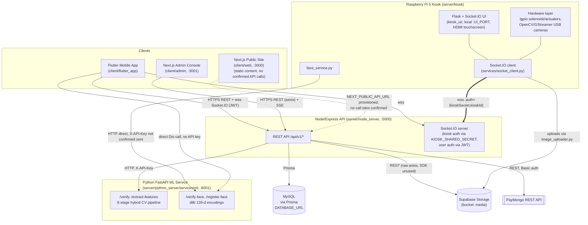
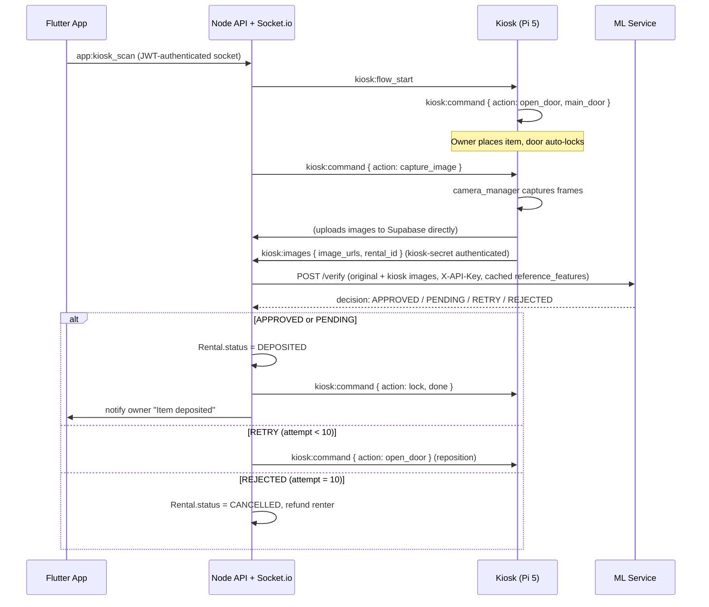

# EngiRent Hub — Codebase Audit

This document describes the system **as it actually exists in code today**, verified file-by-file against the real repository — not the README's original pitch, and not any prior planning document. Ground rules: every non-trivial claim is traceable to a file path; where a doc's claim couldn't be verified in code, that is stated plainly rather than assumed. This is a descriptive audit only — no recommendations or "should build next" content appears below.

---

## Method & File Inventory (read this before anything else)

`git ls-files` returns **415 tracked files**. Top-level tracked paths, collapsed:

```
.claude/, .vscode/
AI_SYSTEM_DOCUMENTATION.md, AI_VERIFICATION_GUIDE.md, EngiRent_Hub_Analysis.md,
ITEM_CATEGORIES.md, README.md, analyzation.md, favicon.ico, render.yaml
client/
  admin/        (Next.js)
  flutter_app/  (Flutter)
  web/          (Next.js)
server/
  kiosk/               (Python — Raspberry Pi controller)
  node_server/         (Node/Express/TypeScript API)
  python_server/services/ml/   (Python/FastAPI — AI verification microservice)
```

**There is no `apps/`, `backend/`, `ml-service/`, `hardware/`, `docker/`, `tests/e2e/`, or `.github/workflows/` anywhere in the tracked tree.** This is the single most important structural fact and it drives most of §15 below.

**Untracked/uncommitted state at audit time** (`git status`, 2026-08-05):
- `AI_SYSTEM_DOCUMENTATION.pdf` and `Engirentpre2.apk` (73 MB) are **staged for deletion** — someone has already started cleaning these up. `.gitignore` already excludes `*.apk` and the PDF filename.
- `AUDIT.md` and `ENGIRENT_FULL_AUDIT_AND_REVAMP_PROMPT.md` are new, untracked files at repo root — **not part of the README's original doc set**, and not requested by this audit's own instructions, but directly relevant: they are the output/input of a **prior, separate audit-and-fix pass dated 2026-07-20**. That pass already rewrote the README's structure/stack sections and applied a number of code fixes. This document treats AUDIT.md as a prior-verified starting point, re-verifies its claims against the code as it exists today, and flags every place the two disagree (see §15.3 — several of AUDIT.md's own "applied automatically" claims turned out not to be true of the current tree).
- Nine files are modified-but-uncommitted, all part of one coherent in-progress fix: a kiosk Socket.io authentication mechanism, ML-service API-key gating, and a rental-status-transition whitelist (`server/node_server/src/{index.ts,config/env.ts,controllers/rentalController.ts}`, `server/kiosk/{config.py,services/socket_client.py,.env.example}`, `server/python_server/services/ml/{app/main.py,app/config.py,app/routers/verification.py,.env.example}`, `client/flutter_app/lib/core/services/socket_service.dart`, `render.yaml`). This document describes the working tree **as it exists right now**, including these uncommitted changes, since that's what the running code actually is.

**README-vs-reality, resolved up front:** the current `README.md` (lines 21–31) already carries a correction banner from the prior audit pass, stating plainly that the real stack is not YOLOv8/GCash/AWS S3/ESP32/`apps-`-style structure/AWS EC2, but an 8-stage hybrid CV pipeline / PayMongo / Supabase Storage / Raspberry Pi 5 + `lgpio` / `client+server` structure / Render.com. This audit independently re-verified every one of those corrections against the actual code (not just trusted the banner) — all six hold true today. Full drift log in §15.

---

## 1. System Overview

EngiRent Hub is a working, non-trivial full-stack system, not a thin thesis demo — but it is a **materially different system** from the one described in the README's original pitch (now partially corrected in-file) and in three of the five root-level docs.

What it actually is: a five-part system — a Flutter mobile app, a Next.js admin console, a Next.js public marketing site, a Node/Express API backed by MySQL (Prisma), and two Python services (a Raspberry Pi 5 kiosk controller and a standalone FastAPI computer-vision microservice) — that lets UCLM engineering students list, rent, and return physical items through a physical locker kiosk. Items are deposited and returned through solenoid-locked lockers; a camera captures images at each checkpoint; a purpose-built 8-stage image-similarity pipeline (perceptual hashing, classical CV features, SIFT/RANSAC, SSIM, a pretrained ResNet50, and OCR — explicitly **not** YOLOv8) compares those images against the item's listing photos and returns a confidence score that drives the rental state machine. Face verification (dlib encodings) gates locker claim/return. Payment runs through PayMongo (not GCash/Xendit as originally documented), and file storage runs through Supabase (not AWS S3).

The core rental lifecycle — list → request → pay → deposit → AI-verify → claim (face-verify) → return → AI-verify → complete — **is real and wired end-to-end in code**, including two genuinely well-designed pieces: a symmetric two-checkpoint verification design (protects the renter at deposit, the owner at return) and anti-gaming safeguards in the scoring pipeline (trimmed-mean aggregation, a minimum-good-pairs rule, an additive-only OCR bonus). As of this audit, a kiosk Socket.io authentication layer is also being actively wired in (present in the uncommitted working tree, not yet committed) that closes a previously wide-open hole where any client could spoof hardware events.

What is **not** real, despite being a headline claim in the README/analysis docs: there is no actual escrow or payout mechanism anywhere in the code — money is collected via PayMongo but never disbursed to owners; a security deposit is never actually collected or refunded, only ledger-recorded; the payment amount charged is still fully client-supplied with no server-side check against the rental price; the "1-hour auto-move unclaimed items to storage" feature and any physical conveyor do not exist in any form; and the emergency-stop button the README describes is not implemented — the only "emergency" control is a software command with no hardware fail-safe. These are documented precisely, with file:line citations, in §11, §16, and §17.

---

## 2. Architecture Diagram

Only components confirmed present in code. Ports/protocols as read from `render.yaml`, `src/config/env.ts`, and the relevant service entry points.



---

## 3. Real Repo Structure

Replaces the README's claimed `apps/` + `backend/` + `ml-service/` + `hardware/` structure entirely — that structure does not exist anywhere in the tracked tree.

```
EngiRent/
├── client/
│   ├── admin/          Next.js 15.5 / React 19 admin console — staff operations UI (port 3001)
│   ├── flutter_app/     Flutter mobile app — renter/owner-facing "Phone App" surface
│   └── web/             Next.js 15.5 / React 18 public marketing/docs site (port 3000)
└── server/
    ├── kiosk/                        Python 3.13 asyncio — Raspberry Pi 5 kiosk controller + local Flask UI
    ├── node_server/                  Node/Express/TypeScript API — Prisma/MySQL, Socket.io, PayMongo, Supabase (port 5000)
    └── python_server/services/ml/    Python 3.12 / FastAPI — standalone 8-stage image-verification microservice (port 8001)
```

One level deeper, by responsibility:

| Path | Responsibility |
|---|---|
| `client/admin/src/app/*/page.tsx` | One route per admin feature: dashboard, users, items, rentals, payments, verifications, reports, kiosk, login |
| `client/admin/src/lib/api.ts` | Axios client + a built-in demo-mode adapter that fakes every endpoint's response |
| `client/flutter_app/lib/core/` | Constants, models (Item/Rental/User/Notification), shared services (API, socket, storage) |
| `client/flutter_app/lib/features/*/` | Per-feature screens+services: auth, home, items, kiosk, rentals, payments, reviews, notifications, **admin** (a second, independent admin UI — see §4.4) |
| `client/web/app/*` | Static-content pages: home, about, docs, pricing, blog |
| `server/node_server/src/routes/`, `controllers/`, `middleware/` | REST API surface, business logic, auth/validation/upload/rate-limit/error-handling |
| `server/node_server/src/index.ts` | Express bootstrap **and** the entire Socket.io kiosk-hardware protocol (auth middleware + ~14 event handlers), inline in one file |
| `server/node_server/prisma/schema.prisma` | Authoritative DB schema |
| `server/node_server/schema.sql` | A stale, hand-written SQL dump — drifted from `schema.prisma`, not a source of truth (§7) |
| `server/kiosk/hardware/` | `gpio_controller.py` (solenoids), `actuator_controller.py` (linear actuators), `camera_manager.py` (USB cameras) — all real `lgpio`/OpenCV code, not mocked |
| `server/kiosk/kiosk_ui/` | Local Flask + Socket.io + vanilla-JS touchscreen UI shown on the kiosk's HDMI display |
| `server/kiosk/services/` | `socket_client.py` (Node connection), `face_service.py` (face-match calls to ML service, with a local fallback), `image_uploader.py` (direct-to-Supabase uploads) |
| `server/kiosk/provisioning/` | Real WiFi captive-portal first-boot setup (`nmcli`-based) |
| `server/python_server/services/ml/app/` | FastAPI app: `routers/` (endpoints), `comparison/` (pipeline engine), `features/` (per-algorithm extractors), `utils/` (pre-processing, quality gate, OCR) |

---

## 4. Client Breakdown

### 4.1 Tech stack per surface (from real `pubspec.yaml`/`package.json`)

| Surface | Framework | State mgmt | HTTP | Notable |
|---|---|---|---|---|
| `flutter_app` | Flutter (SDK per `pubspec.yaml`) | `provider` — but only for auth; every other feature (items/rentals/notifications/reviews/**the in-app admin module**) calls services directly from `StatefulWidget` local state, no shared provider | `http` (primary, via `ApiService`); `dio` installed but used in exactly one place — the ML face-registration multipart call | Socket.io client now sends `auth:{token}` on connect (part of the uncommitted fix) |
| `admin` | Next.js 15.5, React 19, TypeScript | none confirmed used (`zustand` declared, no usage found in the 9 pages read) | `axios`, wrapped in `src/lib/api.ts` with a request interceptor (Bearer from `localStorage.admin_token`) and a response interceptor that clears the token + redirects on 401 | `@heroui/react` (meta-package) + Tailwind v4; **built-in demo-mode Axios adapter** (`api.ts:147-369`) fakes every endpoint's response when `NEXT_PUBLIC_DEMO_MODE !== "false"` outside production |
| `web` | Next.js 15.5, **React 18** (older than admin's 19) | n/a (static content) | none confirmed | Separate, à-la-carte HeroUI install (~28 individual `@heroui/*` packages, not the meta-package admin uses) — two independently-versioned HeroUI installs across the two Next apps |

Flutter dependency reality check (`pubspec.yaml`): of the packages declared, **17 are installed with zero imports anywhere in `lib/`** — `get_it`, `go_router`, `flutter_form_builder`, `form_builder_validators`, `badges`, `shimmer`, `dotted_border`, `qr_flutter`, `app_links`, `permission_handler`, `connectivity_plus`, `flutter_spinkit`, `pdf`, `printing`, `csv`, `url_launcher`, `google_fonts`, `flutter_svg`.

### 4.2 Flutter app — screen inventory

Root routing table, `lib/main.dart:122-190` (`onGenerateRoute`): `/login`, `/register`, `/profile/setup`, `/home`, `/items`, `/items/search`, `/items/create`, `/kiosk/scan`, `/rentals/create`, `/reviews`, plus dynamic-segment matches for `/rentals/:id` and `/items/:id`.

| Screen file | Route / reached via | Talks to |
|---|---|---|
| `features/auth/screens/login_screen.dart` | `/login` (initial) | `AuthProvider` → `AuthService` |
| `features/auth/screens/register_screen.dart` | `/register` | `AuthProvider` → `AuthService` |
| `features/auth/screens/profile_setup_screen.dart` | `/profile/setup` — 3-step camera flow | `ApiService` + a **direct, bare `Dio()` call to the ML service's `/register-face`**, bypassing `ApiService` entirely |
| `features/home/screens/home_screen.dart` | `/home` — 4-tab shell | `AuthProvider`, `RentalService`, `NotificationService`, `SocketService` |
| `features/items/screens/items_screen.dart` | `/items`, `/items/search` | Direct `ApiService` call to `/items`, falls back to demo data on error |
| `features/items/screens/item_detail_screen.dart` | pushed with an `ItemModel` arg | Triggers `/rentals/create` |
| `features/items/screens/create_item_screen.dart` | `/items/create` | `ApiService.uploadFile` + `ItemService.createItem` |
| `features/kiosk/screens/kiosk_scan_screen.dart` | `/kiosk/scan` | `SocketService` (`app:kiosk_scan` emit; listens for `face:verified`/`face:failed`/`kiosk:scan_error`) |
| `features/rentals/screens/create_rental_screen.dart` | `/rentals/create` | `ApiService` (`/kiosk/lockers`, `POST /rentals`) |
| `features/rentals/screens/rental_detail_screen.dart` | `/rentals/:id` | Payment checkout, cancel, dispute; opens `PaymentWebViewScreen` / `KioskScanScreen` / review sheet |
| `features/payments/screens/payment_webview_screen.dart` | pushed from rental detail | PayMongo checkout `WebView` + status polling |
| `features/reviews/screens/reviews_screen.dart` | `/reviews` | Item/user review listing + submission |
| `features/admin/screens/admin_home_screen.dart` | **not a named route** — pushed from the Profile tab when `user.isAdmin` | Direct calls to `/admin/stats`, `/admin/users`, `/admin/rentals`, `/admin/verifications`, `/admin/kiosks` — see §4.4 |

Core services: `lib/core/services/api_service.dart` (base URL **hardcoded** to `https://engirent-api.onrender.com/api/v1` in `app_constants.dart:5`, not env-configurable, unlike both Next.js apps); `socket_service.dart` (now sends `auth:{token}` per the uncommitted fix); `storage_service.dart` (tokens in `flutter_secure_storage`; no biometric data cached locally — face/ID photos are transient `File` handles only).

### 4.3 Flutter models

`ItemModel`, `RentalModel`, `UserModel`, `NotificationModel` in `lib/core/models/` — plain data classes mirroring the corresponding Prisma models, with defensive nullable/`tryParse` fallbacks on most date fields.

### 4.4 Three-surface mapping (required for the design-mandate handoff)

| Design-mandate surface | Actual location | Fit |
|---|---|---|
| **Phone App** | `client/flutter_app/` | Clean fit |
| **Admin Console** | `client/admin/` | Clean fit |
| **Kiosk UI** | `server/kiosk/kiosk_ui/` (Flask + vanilla JS, not React) | Lives entirely outside `client/` — confirmed absent from the Next.js/Flutter tree |
| **Not accounted for by the 3-surface model** | `client/web/` | A real, genuinely EngiRent-branded fourth surface (see below) — the design mandate's 3-surface model has no slot for it |
| **Anomaly** | `client/flutter_app/lib/features/admin/screens/admin_home_screen.dart` | A full, independent ~1300-line second admin console living *inside* the Phone App, reachable only via the Profile tab for admin users. Not a shortcut/redirect — it reimplements dashboard stats, user management, all-rentals (with force-complete/settle), verification review, and kiosk commands a second time, using raw `Map<String,dynamic>` instead of typed models, entirely bypassing `Provider`. Two independently-maintained admin UIs against the same API. |

**`client/web` verdict:** real, not boilerplate. Evidence: the homepage carries "UCLM Engineering Thesis Platform" copy and feature cards describing the actual system (Kiosk QR + Face, AI Verification, Escrow-Controlled Payout); `/about` names the university and a real contact address; `/docs` has four accurate sections (Owner Flow, Renter Flow, Verification Pipeline, Security Controls); `/pricing` has EngiRent-specific tiers, not generic SaaS pricing; `/blog` has three thesis-relevant posts about the system's actual design decisions. Two small unmodified-scaffold leftovers remain: `components/counter.tsx` (the literal unused HeroUI-template demo widget) and `package.json`'s `"name": "next-app-template"` field.

---

## 5. Server Breakdown

### 5.1 `server/node_server` — the main API

- **Stack** (`package.json`): Express 4.21, TypeScript 5.7, Prisma 5.22 (MySQL), Socket.io 4.8, `jsonwebtoken` 9, `bcryptjs` 2.4, `express-validator` 7, `zod` 3.24 (env validation), `multer` 2 (uploads), `axios` 1.7 (PayMongo + ML + Supabase REST calls), `helmet` 8, `winston` + `morgan` (logging), `nodemailer` 8, `node-cron` 4.
- **Entry point:** `src/index.ts` — Express bootstrap, all middleware wiring, route mounting at `/api/${API_VERSION}` (default `v1`), **and** the entire Socket.io kiosk protocol (auth middleware + ~14 event handlers) inline in the same file.
- **Rough edge:** `package.json` defines `"test": "jest --coverage"` but no `jest` package is installed anywhere — there is no working test infrastructure, and no tests exist.
- `@supabase/supabase-js` is a declared dependency that is **not used** — `src/services/storageService.ts` deliberately bypasses the SDK and calls the Supabase Storage REST API directly via `axios`, to use the service-role key without the SDK's RLS behavior.

### 5.2 `server/kiosk` — Raspberry Pi controller

- **Stack** (`requirements.txt`): `flask` 3.1 + `flask-socketio` 5.4 (local UI), `aiohttp`, `supabase` 2.15 (this one IS used, for direct-to-storage uploads), `structlog`, `pillow`. GPIO/camera libraries (`lgpio`, `python3-gpiozero`, OpenCV, `picamera2`) are apt system packages, not in `requirements.txt`.
- **Process model:** one process, one asyncio event loop for the Socket.io client (main thread, blocks forever in `asyncio.run(run_socket_client(...))`), plus two daemon threads: the local Flask/SocketIO UI server, and a camera/QR worker thread. Hardware controllers are instantiated once at startup and injected into the socket-client module.
- **Entry point:** `main.py` — logging setup → WiFi provisioning check (blocks on captive portal if unconfigured) → hardware init → UI thread start → asyncio socket client loop.
- `gpiozero` is still `apt`-installed/imported per a comment ("for venv awareness") despite the code having fully migrated to direct `lgpio` calls — dead dependency.

### 5.3 `server/python_server/services/ml` — verification microservice

- **Stack** (`requirements.txt` + Dockerfile): FastAPI 0.115, `opencv-python-headless` 4.9, `scikit-image` 0.24, `torch`/`torchvision` 2.5/0.20 (CPU wheels installed separately in the Dockerfile from `download.pytorch.org/whl/cpu`, not reflected in the plain `requirements.txt` line), `pytesseract` 0.3.13, `dlib-bin` + `face_recognition_models` (with `face_recognition` itself installed separately in the Dockerfile via `--no-deps` to avoid building dlib from source), `pydantic-settings`, `structlog`.
- **Entry point:** `app/main.py` — FastAPI app, CORS (now an explicit allowlist, no wildcard), router registration.
- Fully decoupled process — no shared code or imports with `node_server` or `kiosk`; all communication is HTTP.

---

## 6. API Surface

Base path `/api/v1` (`API_VERSION` env, defaulted), mounted in `src/routes/index.ts`. "Auth" column reflects what the middleware chain actually enforces, not what a route name implies.

### Auth (`authRoutes.ts` → `authController.ts`)
| Method | Path | Auth | Purpose |
|---|---|---|---|
| POST | `/auth/register` | none | Create account |
| POST | `/auth/login` | none | Login, returns access+refresh tokens |
| POST | `/auth/refresh` | none (body refresh token) | Rotate tokens |
| POST | `/auth/logout` | any user | Null out stored refresh token |
| GET | `/auth/profile` | any user | Get own profile |
| PUT | `/auth/profile` | any user | Update name/phone/parent contact |
| POST | `/auth/profile/complete` | any user | Submit face photo, ID photo, face encoding |
| PUT | `/auth/password` | any user | Change password |

### Items (`itemRoutes.ts`)
| Method | Path | Auth | Purpose |
|---|---|---|---|
| POST | `/items` | any user | Create listing; triggers background ML feature extraction |
| GET | `/items` | optional | Browse/search/filter |
| GET | `/items/my-items` | any user | Own listings |
| GET | `/items/:id` | optional | Detail + reviews |
| PUT | `/items/:id` | owner (checked in controller) | Update — **no body validation on update**, unlike create |
| DELETE | `/items/:id` | owner | Soft-delete (blocked if active rentals exist) |

### Rentals (`rentalRoutes.ts`)
| Method | Path | Auth | Purpose |
|---|---|---|---|
| POST | `/rentals` | any user | Create rental request |
| GET | `/rentals` | any user | List own (renter/owner) |
| GET | `/rentals/:id` | participant | Detail |
| PATCH | `/rentals/:id/status` | participant | Manual transition — **whitelisted** to `PENDING→CANCELLED` / `AWAITING_DEPOSIT→CANCELLED` only (as of the uncommitted fix; see §12) |
| POST | `/rentals/:id/cancel` | participant | Cancel if `PENDING`/`AWAITING_DEPOSIT` |

### Kiosk (`kioskRoutes.ts`)
| Method | Path | Auth | Purpose |
|---|---|---|---|
| POST | `/kiosk/deposit` | owner | Initiate deposit |
| POST | `/kiosk/claim` | renter | Initiate claim |
| POST | `/kiosk/return` | renter | Initiate return |
| GET | `/kiosk/lockers` | any user | List available lockers |
| POST | `/kiosk/lockers/:id/release` | **any authenticated user** | Force-free a locker — route comment says "admin or kiosk service" but no such check exists in `kioskController.ts` |
| POST | `/kiosk/session/start` | any user | App-scanned kiosk QR handshake |

### Payments (`paymentRoutes.ts`)
| Method | Path | Auth | Purpose |
|---|---|---|---|
| POST | `/payments` | any user (rental owner check) | Create PayMongo checkout session |
| POST | `/payments/confirm` | none | Confirm payment — see §11 for a routing bug that makes real webhooks likely unreachable |
| GET | `/payments` | any user | Own transactions |
| POST | `/payments/:transactionId/refund` | any user | Refund |

### Notifications, Reviews, Upload
| Method | Path | Auth | Purpose |
|---|---|---|---|
| GET | `/notifications` | any user | List + unread count |
| PATCH | `/notifications/:id/read` | any user | Mark read |
| PATCH | `/notifications/read-all` | any user | Mark all read |
| DELETE | `/notifications/:id` | any user | Delete |
| POST | `/reviews` | participant, rental must be `COMPLETED` | Submit ITEM or USER review |
| GET | `/reviews/me` | any user | Own authored reviews |
| GET | `/reviews/item/:itemId` | none | Public item reviews |
| GET | `/reviews/user/:userId` | none | Public user reviews |
| POST | `/upload/image` | any user | Single image → Supabase |
| POST | `/upload/images` | any user | Up to 10 images → Supabase |

### Admin (`adminRoutes.ts`) — `router.use(authenticate, requireAdmin)` applied once at the router level, so every route below is consistently admin-gated
| Method | Path | Purpose |
|---|---|---|
| GET | `/admin/stats` | Dashboard counters + revenue |
| GET | `/admin/users` | List/search users |
| PATCH | `/admin/users/:id` | Toggle active/verified/role |
| POST | `/admin/users/admin` | Create another admin |
| GET | `/admin/rentals` | All rentals, filterable |
| POST | `/admin/rentals/:id/complete` | Force-complete from `VERIFICATION`/`DISPUTED` |
| POST | `/admin/rentals/:id/settle` | Resolve `DISPUTED` |
| GET | `/admin/transactions` | All transactions |
| POST | `/admin/transactions/:transactionId/refund` | Manual refund — **ledger-only, no PayMongo call** (unlike `/payments/:id/refund`) |
| GET | `/admin/verifications` | AI-verification queue |
| PATCH | `/admin/verifications/:id` | Manual APPROVE/REJECT |
| GET | `/admin/reports` | Aggregated stats (`?format=json\|csv\|pdf`) |
| GET | `/admin/kiosks/events` | SSE stream of kiosk telemetry (route order before `:kioskId` is intentional) |
| GET | `/admin/kiosks` | Distinct kiosk IDs |
| GET/PUT | `/admin/kiosks/:kioskId/config` | Get/update kiosk timing config, pushed live via socket |
| POST | `/admin/kiosks/:kioskId/command` | Send arbitrary hardware command |

### Health
| Method | Path | Purpose |
|---|---|---|
| GET | `/health` | Docker/Render health check, no auth |

### README's claimed endpoints vs. reality
The README's originally-listed endpoint shapes (`/api/auth/register`, `/api/rentals`, `/api/kiosk/deposit`, `/api/ml/verify`) are directionally right but under the wrong base path (`/api/v1/...`, not `/api/...`) and the ML endpoint is not proxied through the main API at all — it's a separate service the Node backend calls server-to-server, never exposed to clients as `/api/ml/verify`.

---

## 7. Database Schema

**ORM/DB:** Prisma 5.22 against MySQL (`schema.prisma`, 461 lines). Client targets `native` + `linux-musl-openssl-3.0.x` (Render Alpine deploy).

### Models (fields condensed to the non-obvious ones)

| Model | Notable fields |
|---|---|
| **User** | `faceEncoding Json?` (128-float dlib embedding, unencrypted), `idImageUrl`, `profileComplete Boolean`, `parentName`/`parentContact`, `isVerified`, `isActive`, `role UserRole @default(STUDENT)`, `refreshToken String? @db.Text` |
| **Item** | `category ItemCategory`, `condition ItemCondition`, `pricePerDay/Week/Month`, `securityDeposit`, `images Json`, `mlFeatures Json?` (cached ResNet50+traditional features), `serialNumber`, `campusLocation`, `totalRentals`, `averageRating` |
| **Rental** | `status RentalStatus`, `totalPrice`, `securityDeposit`, `depositLockerId`/`claimLockerId`/`returnLockerId`, `depositVerificationId`/`verificationId` (two distinct FKs to `Verification`), `depositAttemptCount`/`returnAttemptCount`, `depositedAt`/`claimedAt`/`returnedAt`/`completedAt` |
| **Transaction** | `type TransactionType`, `amount`, `status TransactionStatus`, `paymentReferenceNo`/`paymentTransactionId` (unique), `paymongoPaymentId`/`paymongoCheckoutId` (unique), `paymentMethod @default("PayMongo")`, `paymentDetails Json?` |
| **Verification** | `originalImages`/`kioskImages Json`, `decision VerificationDecision`, `confidenceScore Float`, `attemptNumber`, `traditionalScore`/`siftScore`/`deepLearningScore`, `ocrMatch`/`ocrDetails`, `status VerificationStatus`, `reviewedBy`/`reviewNotes` |
| **Locker** | `lockerNumber @unique`, `kioskId`, `size LockerSize`, `status LockerStatus`, `isOperational`, `currentRentalId` |
| **KioskConfig** | `kioskId @unique`, `config Json`, `updatedBy` |
| **Notification** | `title`, `message`, `type NotificationType`, `relatedEntityId`/`Type`, `isRead`/`readAt` |
| **Review** | `itemId`, `rentalId?`, `authorId`, `recipientId`, `rating Int`, `comment?`, `reviewType ReviewType`, `@@unique([rentalId, authorId, reviewType])` |

### Enums (verbatim from `schema.prisma`)
- `UserRole`: `STUDENT`, `ADMIN`
- `ItemCategory`: `SCHOOL_ATTIRE`, `ACADEMIC_TOOLS`, `ELECTRONICS`, `DEVELOPMENT_KITS`, `MEASUREMENT_TOOLS`, `AUDIO_VISUAL`, `SPORTS_EQUIPMENT`, `OTHER`
- `ItemCondition`: `NEW`, `LIKE_NEW`, `GOOD`, `FAIR`, `ACCEPTABLE`
- `RentalStatus`: `PENDING`, `AWAITING_DEPOSIT`, `DEPOSITED`, `AWAITING_CLAIM`, `ACTIVE`, `AWAITING_RETURN`, `VERIFICATION`, `COMPLETED`, `CANCELLED`, `DISPUTED` — **`AWAITING_CLAIM` and `AWAITING_RETURN` are declared but no code path in `src/` ever assigns either value**; the real flow goes `DEPOSITED`→`ACTIVE` directly and has no intermediate return-pending state
- `VerificationDecision`: `APPROVED`, `PENDING`, `RETRY`, `REJECTED`
- `VerificationStatus`: `PENDING`, `PROCESSING`, `COMPLETED`, `MANUAL_REVIEW`, `APPROVED`, `REJECTED`
- `TransactionType`: `RENTAL_PAYMENT`, `SECURITY_DEPOSIT`, `DEPOSIT_REFUND`, `LATE_FEE`, `DAMAGE_FEE`
- `TransactionStatus`: `PENDING`, `PROCESSING`, `COMPLETED`, `FAILED`, `REFUNDED`
- `NotificationType`: 12 values incl. `BOOKING_CONFIRMED`, `ITEM_READY_FOR_CLAIM`, `VERIFICATION_FAILED`, `RENTAL_DISPUTED`, `PAYMENT_RECEIVED`
- `LockerSize`: `SMALL`, `MEDIUM`, `LARGE`, `EXTRA_LARGE`
- `LockerStatus`: `AVAILABLE`, `OCCUPIED`, `RESERVED`, `MAINTENANCE`, `OUT_OF_SERVICE`
- `ReviewType`: `ITEM`, `USER`

### `server/node_server/schema.sql` — confirmed stale, not a source of truth
This file is a hand-written/exported raw MySQL DDL dump with no Prisma migration markers, and it is **drifted from `schema.prisma`** in at least five confirmed ways: it has no `users.role` column at all; it's missing `faceEncoding`/`idImageUrl`/`profileComplete`; its `transactions` table still uses `gcashReferenceNo`/`gcashTransactionId`/`paymentMethod DEFAULT 'GCash'` instead of the PayMongo fields; it's missing the `kiosk_configs` table entirely; and its `reviews` table has no `rentalId` column (so the real `@@unique([rentalId, authorId, reviewType])` constraint can't exist in it). It predates the role system, biometric fields, the GCash→PayMongo migration, kiosk config, and the rental-linked review constraint. `schema.prisma` (applied via `prisma db push`, per `render.yaml`'s `preDeployCommand`) is the only current schema.

---

## 8. AI/ML Verification

**Confirmed: not YOLOv8.** A standalone FastAPI microservice running an 8-stage hybrid image-similarity pipeline (`server/python_server/services/ml/app/comparison/hybrid.py`), called over HTTP by the Node backend (`/verify`, `/extract-features`) and, separately, by both the Flutter app and the kiosk directly for face matching (`/register-face`, `/verify-face`).

### Pipeline stages (`hybrid.py`, in order)

| # | Stage | Source | What it does |
|---|---|---|---|
| 1 | Quality gate | `utils/quality.py` | Laplacian-variance blur check, brightness range check, foreground-coverage check. All-fail → immediate `RETRY`. |
| 2 | Perceptual hash pre-filter | `features/phash.py` | DCT-based pHash + gradient dHash, Hamming distance. All-pairs-below-40% → immediate `RETRY`/`REJECTED`. |
| 3 | Traditional CV | `features/traditional.py` | HSV color histogram (84-d), 3×3 spatial color pyramid (108-d), Hu-moment shape (7-d), multi-scale LBP texture (62-d), HOG, ORB descriptors — combined into one weighted sub-score per image pair |
| 4 | SIFT + FLANN + RANSAC | `features/sift.py` | SIFT keypoints, FLANN kNN matching, Lowe's ratio test (0.7), RANSAC homography inlier filtering — `score = inlier_ratio×0.7 + match_ratio×0.3` |
| 5 | SSIM | `comparison/similarity.py` | Structural similarity (Wang et al. 2004) on 256×256 grayscale |
| 6 | ResNet50 deep features | `features/deep.py` | ImageNet-pretrained ResNet50, classification head removed, 2048-d vector, cosine similarity. Lazy-loaded; CPU inference by default (~500ms/image). |
| 7 | OCR serial matching | `utils/ocr.py` | Tesseract via `pytesseract`, regex extraction of serial/model numbers, exact-string-set intersection |
| 8 | Hybrid weighted score | `hybrid.py` | See below |

Background removal (GrabCut for listing photos, white-threshold for kiosk photos) and CLAHE/gray-world preprocessing run ahead of stages 3–6, not separately numbered but load-bearing.

### Aggregation & decision

- Per-pair scores (traditional/SSIM/deep) are combined across all original×kiosk image pairs via **trimmed mean** by default: sort ascending, drop bottom 20% / top 10%, mean the rest (falls back to `max()` for ≤2 scores).
- **Weighted final score:** `traditional×0.30 + deep×0.25 + sift×0.20 + ssim×0.15 + phash_best×0.10` (redistributed proportionally if deep learning is disabled).
- **OCR bonus:** additive-only, flat `+10`, capped at 100 — cannot by itself carry a failing score to `APPROVED`.
- **Anti-gaming safety check:** if fewer than 2 image pairs scored ≥60% on the traditional stage, a score that would otherwise be ≥85 is capped at 84 (demoted from auto-approval to manual review).
- **Thresholds** (`config.py`): `≥85` → `APPROVED`; `60–84` → `PENDING` (admin review); `<60` → `RETRY` (attempt <10) or `REJECTED` (attempt =10).

### Face verification (separate from item verification)

- dlib, 128-float encoding, via the `face_recognition` library (falls back to Haar-cascade detection-only if unavailable).
- `/register-face` — called **directly by the Flutter app** (`profile_setup_screen.dart`, bare `Dio()` client, no `X-API-Key`), one-face-only enforcement, returns encoding + preview crop. Result is stored via `POST /auth/profile/complete` into `User.faceEncoding` — plain JSON, **unencrypted**.
- `/verify-face` — called **directly by the kiosk** (`face_service.py`), prefers a stored 128-float encoding over re-fetching `reference_image_url` (`urlretrieve`, unbounded — an open SSRF surface, not gated by the new API-key check's presence). Threshold `distance ≤ 0.5`. The kiosk has a **local fallback**: if the ML call fails, it substitutes an OpenCV Haar-cascade face-size heuristic at `confidence ≥ 0.80` — a materially weaker check silently substituted on ML-service outage.

### Feature caching

When an item is created, `itemController.ts` fires a non-blocking `setImmediate` call to `/extract-features`, and the result (traditional + deep feature vectors + OCR text, **not** a verification result) is cached in `Item.mlFeatures`. Both deposit and return verification send this cached blob as `reference_features`, skipping re-extraction (~2–3s saved per call, largely the ResNet50 cost). **Confirmed not invalidated on photo edit:** `itemController.ts`'s `updateItem` does not null out `mlFeatures` when `images` changes — a stale cached feature vector is silently compared against new listing photos after an owner edits their photos. (AUDIT.md claimed this was already fixed; it is not, in the current tree.)

### Security state of the ML service (current, uncommitted working tree)

`require_api_key` (`routers/verification.py`) is wired via `Depends()` on `/verify`, `/extract-features`, `/register-face`, and `/verify-face` (not on `/health`, by design). CORS now builds an explicit allowlist from `ML_ALLOWED_ORIGINS`, no wildcard fallback. **However:** neither the Flutter app's `/register-face` call nor the kiosk's `/verify-face` call was confirmed to send an `X-API-Key` header — once `ML_API_KEY` is set for real in production, both call sites are at risk of a silent 401 (the Flutter side explicitly treats this as non-fatal, so profile completion would "succeed" with no face encoding stored, quietly degrading identity verification for that user).

---

## 9. Hardware/IoT Integration

**Confirmed real, not placeholder:** a full Raspberry Pi 5 GPIO/camera control layer exists and is exercised by real code (not a tutorial copy-paste) — `lgpio` direct calls, GStreamer camera pipelines, a real WiFi captive-portal provisioning flow. **Confirmed absent:** no ESP32, no MQTT, anywhere in the codebase — the README's original hardware description does not match reality on this point, and the current README banner already says so.

### Inventory

| Component | Count | Detail |
|---|---|---|
| Controller | 1 | Raspberry Pi 5 (4GB+), GPIO via `lgpio` with auto-detection of the RP1 chip (handles the `gpiochip4`→`gpiochip0` rename across kernel versions) |
| Solenoid locks | 8 | 4 lockers × 2 doors (`main_door` + `bottom_door`), active-LOW by default, GPIO 2–9 |
| Linear actuators | 4 | One per locker, 2-relay polarity-reversal control (extend/retract/stop, never both relays on), GPIO 10–17 |
| Cameras | 5 | All USB webcams via OpenCV/GStreamer — 4 locker/item cameras (index 0–3, 1280×720 MJPEG w/ YUYV fallback) + 1 face/QR camera (index 4, 640×480). No Pi Camera Module anywhere. |
| Touchscreen | 1 | HDMI, local Flask+vanilla-JS UI |
| Sensors | 0 | No door-closed sensor, IR, or weight sensor found anywhere |
| Emergency stop | **0 — not implemented** | No dedicated E-stop GPIO pin exists in `config.py`. The only "emergency" control is `_cmd_lock_all` — a software command dependent on the Pi process and socket connection being alive, not a physical fail-safe |
| Conveyor | **0 — not implemented** | No conveyor code, no "1-hour auto-move unclaimed items" cron/timer anywhere in `server/kiosk` or `server/node_server` (confirmed via repo-wide grep for conveyor/unclaimed/auto-move/delayed-pickup — zero matches) |

### Software architecture

One process (`main.py`), one asyncio event loop (Socket.io client, blocking main thread) plus two daemon threads (local Flask/SocketIO UI, camera/QR worker). Offline resilience: critical outbound events (`kiosk:ack`, `kiosk:face`, `kiosk:images`, etc.) queue to `offline_queue.json` (cap 100) while disconnected and flush on reconnect; volatile events (`kiosk:status`, `kiosk:log`) are dropped while offline.

### Kiosk UI states

`kiosk_ui/static/app.js` defines exactly seven states: `IDLE, MAIN, QR, CONFIRM, FACE, SUCCESS, ERROR`. **Confirmed: no dedicated "AI verification in progress / do not leave" state exists.** The item-photo AI-verification stage runs entirely server-side on Node after `kiosk:images` is received; the kiosk UI has no state that reflects it, and the inactivity timer (30s from MAIN, 5min from active flow screens) is not suspended for it — only face-match has a "Verifying…" label, and that covers face-match alone, not item verification.

---

## 10. End-to-End Process Flow

Status per step reflects what's actually reachable in code today, not intended design.

| Step | Status | Evidence |
|---|---|---|
| (a) Owner lists an item | **Fully implemented** | `POST /upload/images` → `POST /items` → background `setImmediate` call to `/extract-features`, cached to `Item.mlFeatures` |
| (b) Renter requests + pays | **Partially wired** | `POST /rentals` (status `PENDING`) → `POST /payments` creates a real PayMongo checkout session, but the charged **amount is fully client-supplied with no server-side check** against `rental.totalPrice`/`securityDeposit`; the webhook confirmation route (`POST /payments/confirm`) has an `express-validator` chain requiring top-level `transactionId`/`gcashReferenceNo` fields a real PayMongo webhook payload never sends at the top level (they're nested under `data.attributes`) — meaning the "real webhook" code branch in `confirmPayment` is likely unreachable as currently routed, and only the manual/dev confirmation path is exercised in practice |
| (c) Deposit at kiosk | **Fully implemented end-to-end**, auth gap just closed | App-initiated QR scan → `kiosk:flow_start` → `open_door` → owner places item → `capture_image` → Pi uploads to Supabase → `kiosk:images` (now gated to authenticated-kiosk-only sockets) → Node calls ML `/verify` with cached reference features → decision drives `DEPOSITED`/`CANCELLED`/retry |
| (d) Claim from kiosk | **Fully implemented**, with a silent weaker fallback | `capture_face` → kiosk calls ML `/verify-face` (falls back to a materially weaker local Haar-cascade heuristic on ML-service failure, with no signal surfaced to the user or admin that a weaker check was used) → `kiosk:face` (gated) → `DEPOSITED→ACTIVE`, locker opens |
| (e) Return + condition check | **Partial** | Same capture sequence → ML compares original vs. returned images → `APPROVED` completes the rental, but "security deposit refunded" and "payment released to owner" exist **only as notification text** — no real payout/transfer/refund transaction is ever created (grepped repo-wide for payout/transfer/disburse: zero hits). `REJECTED` correctly routes to `DISPUTED` for admin review. Late fee is a hardcoded flat ₱50/day cron (`index.ts`, daily), ledger-recorded only — no real charge is collected. |

### Deposit flow, sequence (fully implemented path)



---

## 11. Payment Integration

**Real gateway: PayMongo**, not GCash/Xendit — confirmed via live `axios` calls in `paymentController.ts` to `https://api.paymongo.com/v1`, Basic-auth with the secret key, `payment_method_types: ["gcash","paymaya","card","brankas_bdo"]` (GCash is one payment *method* offered through PayMongo, not the gateway itself). Refunds likewise hit a real `/refunds` endpoint. If `PAYMONGO_SECRET_KEY` is unset, both fall back to a mock checkout URL — a deliberate dev fallback, not a stub replacing the real logic.

**Webhook signature verification is real** (`verifyWebhookSignature` — HMAC-SHA256, `crypto.timingSafeEqual`, parses PayMongo's `t=...,te=...` header) — but returns `true` unconditionally if `PAYMONGO_WEBHOOK_SECRET` is unset, so signature checking is optional, not enforced.

**Confirmed still open, unchanged from the prior audit:**
- **Client-controlled amount:** `createPayment` reads `amount` straight from `req.body`, parses it, and writes it directly to both the `Transaction` row and the PayMongo checkout line item — no comparison against the rental's actual price or deposit anywhere in the function. Route-level validation only checks `isFloat({min:0})`.
- **No escrow or payout exists at all:** money is collected into the platform's PayMongo account; there is no transfer/payout/disbursement code anywhere in `server/node_server/src/` (repo-wide grep for payout/transfer/disburse returns zero hits). "Payment released to owner" and "security deposit refund is being processed" exist only as notification strings.
- **Security deposit is never actually collected or refunded** — `confirmPayment` advances the rental on *either* a `RENTAL_PAYMENT` or a `SECURITY_DEPOSIT` transaction completing (not both), and no `DEPOSIT_REFUND` transaction is ever created on completion.
- **Damage fees are ledger-only** — `settleDispute` creates a `DAMAGE_FEE` transaction row with `status: COMPLETED` but moves no real money and has no held-deposit pool to draw from.

**New finding this pass:** the `/payments/confirm` route's request-body validator requires fields (`transactionId`, `gcashReferenceNo`) that don't match the shape of a genuine PayMongo webhook payload (nested under `data.attributes`), meaning that branch of `confirmPayment` is likely unreachable via the actual route as currently wired — only the manual/dev-confirm path gets exercised.

---

## 12. Auth & Permissions

### REST API
- **JWT access + refresh**, `src/utils/jwt.ts` — access token payload `{userId, email, studentId, role}`, `JWT_EXPIRE` defaults 7 days, `JWT_REFRESH_EXPIRE` 30 days. Refresh tokens are persisted per-user in `User.refreshToken` and compared exactly on `/auth/refresh` (single active refresh token per user — logging in elsewhere invalidates the old one).
- **No revocation of an already-issued access token** before natural expiry — `logout` only nulls the refresh token.
- `bcryptjs`, 10 salt rounds, no pepper.
- **Middleware** (`middleware/auth.ts`): `authenticate` (verifies + re-fetches user, rejects inactive accounts), `requireAdmin` (must be chained after `authenticate`; checks `role === "ADMIN"`), `optionalAuth`.
- **Consistency:** `adminRoutes.ts` applies `authenticate, requireAdmin` once at the router level, so every admin route is uniformly gated. Everywhere else, ownership checks are ad-hoc per-controller (e.g. `item.ownerId !== req.user.userId`) rather than shared middleware — functionally fine where present, but `kioskController.releaseLocker` has **no ownership or admin check at all**, only base `authenticate`, despite its own route comment claiming "admin or kiosk service" — any logged-in student can force-release any locker for any rental.

### Socket.io (kiosk hardware channel) — current working-tree state
An `io.use()` auth middleware (part of the uncommitted fix) tags every connecting socket:
1. **Kiosk** — `auth.kioskSecret` or an `x-kiosk-secret` header, compared to `env.KIOSK_SHARED_SECRET`. Match → `socket.data.kind = "kiosk"`.
2. **User** — `auth.token` or an `Authorization` bearer, verified as a JWT. Match → `socket.data.kind = "user"`.
3. **Anon** — fallback; can connect but is excluded from every privileged event.

Fail-closed: if `KIOSK_SHARED_SECRET` is unset, a startup warning fires and **no socket can ever authenticate as kiosk** — every `kiosk:*` hardware event is then silently dropped. All ~14 kiosk event handlers (`kiosk:register`, `kiosk:images`, `kiosk:face`, `kiosk:status`, `kiosk:ack`, `kiosk:rental_lookup`, `kiosk:admin_snapshot`, `kiosk:flow_start`, `kiosk:error`, `kiosk:log`, `kiosk:scan_error_relay`) now gate on `isKiosk(socket)`; `join` and `app:kiosk_scan` gate on `isUser(socket)` and trust the authenticated identity rather than any client-supplied user ID. **This closes what was previously a critical, unauthenticated hole** where any socket could spoof `kiosk:face`/`kiosk:images` to open a locker or drive a rental/payment through its full state machine.

### Rental status transitions — whitelist confirmed
`rentalController.ts` now defines `ALLOWED_MANUAL_TRANSITIONS = { PENDING: ["CANCELLED"], AWAITING_DEPOSIT: ["CANCELLED"] }` and `PATCH /rentals/:id/status` rejects any transition not on this list — a participant can no longer manually force a rental into `DEPOSITED`/`ACTIVE`/`COMPLETED`/etc.; those states are now only reachable via the kiosk/ML pipeline or the dedicated admin endpoints.

### Admin auth (separate from user JWT)
Admin console stores its JWT in `localStorage` (`admin_token`); a response interceptor clears it and redirects to `/login` on any 401.

---

## 13. Config & Environment

### `server/node_server` (`src/config/env.ts`, zod-validated, fails fast on boot)

| Group | Vars |
|---|---|
| Server | `NODE_ENV`, `PORT` (default 5000), `API_VERSION` (default `v1`) |
| Database | `DATABASE_URL` **(required)** |
| JWT | `JWT_SECRET`/`JWT_REFRESH_SECRET` **(required, min 32 chars)**, `JWT_EXPIRE` (7d), `JWT_REFRESH_EXPIRE` (30d) |
| ML service | `ML_SERVICE_URL` (default `localhost:8001`), `ML_SERVICE_API_KEY` |
| PayMongo | `PAYMONGO_SECRET_KEY`, `PAYMONGO_PUBLIC_KEY`, `PAYMONGO_WEBHOOK_SECRET` |
| Supabase | `SUPABASE_URL` **(required)**, `SUPABASE_SERVICE_ROLE_KEY` **(required)**, `SUPABASE_STORAGE_BUCKET` (default `media`) |
| Frontend CORS | `CLIENT_WEB_URL`, `CLIENT_MOBILE_URL`, `CLIENT_ADMIN_URL` |
| Kiosk | `KIOSK_SHARED_SECRET` (min 16 chars, drives the Socket.io auth gate); `KIOSK_RASPBERRY_PI_URL`, `KIOSK_WEBHOOK_SECRET` — **declared but never read outside `env.ts`**, dead |
| Rate limiting | `RATE_LIMIT_WINDOW_MS` (900000), `RATE_LIMIT_MAX_REQUESTS` (100) |
| Uploads | `MAX_FILE_SIZE`, `ALLOWED_FILE_TYPES` — **both declared but ignored**; `middleware/upload.ts` hardcodes its own 10MB limit and MIME allowlist instead |
| Logging | `LOG_LEVEL` (default `info`) |
| Email | `SMTP_HOST`/`PORT`/`USER`/`PASSWORD`/`FROM` |
| Admin bootstrap | `ADMIN_EMAIL`/`ADMIN_PASSWORD`/`ADMIN_STUDENT_ID` — read only by `prisma/seed.ts`, not by `src/` |

### `server/kiosk` (`config.py`)

| Group | Vars |
|---|---|
| Identity/network | `KIOSK_ID`, `SERVER_URL`, `ML_SERVICE_URL` |
| Auth | `KIOSK_SHARED_SECRET` |
| Supabase | `SUPABASE_URL`, `SUPABASE_SERVICE_ROLE_KEY`, `SUPABASE_STORAGE_BUCKET` |
| Local UI | `UI_PORT` |
| WiFi AP | `AP_SSID`, `AP_PASSWORD`, `AP_IP` |
| Hardware | `RELAY_ACTIVE_LEVEL`, `MOCK_GPIO`, `MOCK_CAMERA` (full simulation mode for hardware-free dev) |

`kiosk_ui/server.py` also reads its own separate `KIOSK_SECRET` var (distinct name from `KIOSK_SHARED_SECRET`) for local QR-token HMAC signing.

### `server/python_server/services/ml` (`app/config.py`, all `ML_`-prefixed)

| Group | Vars |
|---|---|
| Service | `debug`, `host`, `port` (8001) |
| Security | `api_key` (`ML_API_KEY`), `allowed_origins` (`ML_ALLOWED_ORIGINS`) |
| Thresholds | `threshold_verified` (85), `threshold_manual_review` (60), `max_retry_attempts` (10) |
| Weights | 7 traditional-CV weights + 5 hybrid-method weights, each independently configurable, documented to sum to 1.0 |
| Feature extraction | `orb_features_count`, `sift_ratio_threshold`, `lbp_points`/`radius`, `color_hist_bins` |
| Quality gate | `quality_min_blur_score`, `quality_min/max_brightness`, `quality_min_coverage` |
| Toggles | `enable_deep_learning`, `enable_ocr` |
| Aggregation | `min_good_pairs` (2), `score_aggregation` (`trimmed_mean`/`max`/`median`) |

---

## 14. Deployment

`render.yaml` (current working tree, including the uncommitted `KIOSK_SHARED_SECRET`/`ML_API_KEY`/`ML_ALLOWED_ORIGINS` additions) defines **4 Render.com services**, region `singapore`:

| Service | Type | Root dir | Notes |
|---|---|---|---|
| `engirent-api` | Node web | `server/node_server` | `preDeployCommand: npx prisma db push && npx prisma db seed`; health check `/api/v1/health` |
| `engirent-admin` | Next.js web | `client/admin` | `NEXT_PUBLIC_API_URL` points at `engirent-api` |
| `engirent-web` | Next.js web | `client/web` | Same `NEXT_PUBLIC_API_URL` var provisioned, though no confirmed call sites in the pages read |
| `engirent-ml` | Docker | `server/python_server/services/ml` | `plan: starter` (paid tier, unlike the other three's `plan: free`); health check `/` |

This matches what `client`/`server` actually need to run: four independently-deployable services, one shared MySQL instance reachable via `DATABASE_URL` (not itself defined in `render.yaml` — provisioned separately, `sync: false`), Supabase and PayMongo as external managed services. The `server/kiosk` component is **not** in `render.yaml` at all — by design, since it runs on physical Pi hardware, not on Render.

The kiosk connects out to the deployed `engirent-api` and `engirent-ml` Render URLs, and uploads images directly to Supabase (bypassing the Node API for that leg).

---

## 15. README/Docs Drift Log

### 15.1 README.md — self-corrected, verified accurate

The current README (lines 21–31) carries a banner from a prior audit pass listing six corrections. Each was independently re-verified against the code in this pass:

| README's original claim | Reality | Status |
|---|---|---|
| YOLOv8 item verification | 8-stage hybrid CV similarity pipeline (§8) | **Confirmed corrected** |
| GCash API / Xendit payments | PayMongo | **Confirmed corrected** |
| AWS S3 storage | Supabase Storage | **Confirmed corrected** |
| ESP32 + MQTT hardware | Raspberry Pi 5, `lgpio` direct GPIO, no MQTT/ESP32 anywhere | **Confirmed corrected** |
| `apps/`+`backend/`+`ml-service/`+`hardware/` structure | `client/{admin,web,flutter_app}` + `server/{node_server,python_server,kiosk}` | **Confirmed corrected** |
| AWS EC2 + Nginx deployment | Render.com, `render.yaml` | **Confirmed corrected** |

### 15.2 Other root docs

| Doc | Verdict |
|---|---|
| `AI_SYSTEM_DOCUMENTATION.md` | **Authoritative.** Matches the current ML pipeline code precisely — stages, weights, thresholds, aggregation logic, API shapes all check out. |
| `analyzation.md` | **Authoritative, with minor known staleness.** Matches current hardware/DB/API/deployment reality closely; one confirmed drift — its API table describes `PATCH /rentals/:id/status` as accepting locker-assignment fields, which is now superseded by the transition whitelist (§12). Its "Recent Changes" section is dated to commits through 2026-04-23 and predates the kiosk-auth/ML-auth work entirely. |
| `AI_VERIFICATION_GUIDE.md` | Carries a "superseded/historical" banner (prior audit pass); describes an early YOLOv8 design that was never shipped. Correctly marked, not authoritative. |
| `EngiRent_Hub_Analysis.md` | Carries a "partially superseded" banner; process-flow diagrams are still directionally useful but name YOLOv8/GCash/AWS S3 and assume a working escrow-release step that doesn't exist in code (§11). Correctly marked. |
| `ITEM_CATEGORIES.md` | Reference/planning data (survey results, suggested pricing, locker-size guidance) — accurate as reference data, not a description of enforced system behavior. The suggested per-category pricing is not what the code actually charges for late fees (§17). |

### 15.3 `AUDIT.md` itself — a meta-finding

`AUDIT.md` (dated 2026-07-20) is a prior, separate audit-and-fix deliverable, not part of this task's scope, but its claims were used as a starting point for this document and independently re-verified. **Several of its "applied automatically" fix claims do not match the current code:**

| AUDIT.md claim | Current reality |
|---|---|
| H8 — "`mlFeatures` nulled out whenever `images` changes in `updateItem`" | **Not present.** `itemController.ts`'s `updateItem` does not touch `mlFeatures` (§8) |
| H9 — "`persistMlFeatures` removed" | **Not present.** The function still exists and is still called, still writing the verification-result shape into `Item.mlFeatures` |
| L3 — "`@@index([status, endDate])` added to `Rental`" | **Not present.** Only a single-column `@@index([status])` exists |
| M2 — "stale `actuator_speed_percent` field dropped from `DEFAULT_LOCKER_CONFIG`" | **Not present.** Still there in `adminController.ts` |
| M3 — "late fee derived from item/rental rate, ₱50 as fallback" | **Not present.** Still a hardcoded flat `LATE_FEE_RATE_PER_DAY = 50` |

By contrast, **two of AUDIT.md's gated (not-yet-applied) Critical findings — C1/C2 (unauthenticated kiosk socket events) and M11 (unrestricted rental status transitions) — are genuinely fixed** in the current uncommitted working tree, along with C7's authentication half (ML API-key gating) and M9 (ML CORS wildcard). The pattern suggests fixes proceeded selectively and out of sync with AUDIT.md's own status table, rather than AUDIT.md being wrong about the code at the time it was written — treat AUDIT.md's prose findings as reliable history, but not its "applied automatically" checkboxes as a current changelog.

---

## 16. Feature Completeness Matrix

| Feature | Status | Evidence |
|---|---|---|
| User auth (register/login/refresh/logout) | **Done** | `authController.ts`, JWT + bcrypt |
| Profile completion (face + ID capture) | **Partial** | Captured and stored, but ID is never verified against identity, and face data is unencrypted/publicly-bucketed (§8, §17) |
| Item listing/browsing | **Done** | `itemController.ts` full CRUD + filters + pagination |
| Rental request/approval flow | **Done** | `rentalController.ts`, whitelisted manual transitions |
| PayMongo payment | **Partial/drifted** | Real checkout sessions created; amount client-controlled (C3); webhook route likely unreachable as wired (§11) |
| Escrow / payout to owner | **Not implemented** | No transfer/payout code exists anywhere (§11) |
| Security deposit collection/refund | **Not implemented** | Never actually collected or refunded, ledger-only intent (§11) |
| QR-code kiosk interaction | **Done** | App-initiated scan → `kiosk:flow_start` → hardware sequence |
| Facial recognition (kiosk gate) | **Done, with a silent weaker fallback** | dlib via ML service; falls back to a local heuristic on ML outage (§8) |
| AI item verification (deposit + return) | **Done** | Both checkpoints wired; genuinely complete 8-stage pipeline (§8) |
| Locker/solenoid control | **Done** | Real `lgpio` GPIO code, 8 solenoids, 4 actuators (§9) |
| Emergency stop | **Not implemented** | No E-stop GPIO; software-only `lock_all` (§9) |
| Conveyor / 1-hour auto-move | **Not implemented** | No such code anywhere (§9) |
| Notifications (in-app + email) | **Done** | Socket + DB rows + SMTP; two email templates defined but never called (`sendBookingConfirmed`, `sendReturnReminder`) |
| Admin dashboard/console | **Done** | Full page set in `client/admin`; a second, independent admin UI also exists inside the Flutter app (§4.4) |
| Mobile app | **Done, with dead dependencies** | Full feature set implemented; ~17 declared packages unused |
| In-app chat | **Not found in code** | No chat implementation anywhere in `client/` or `server/`, despite being mentioned in older docs |
| Rating/review system | **Done, bidirectional** | `reviewController.ts` — both renter→owner and owner→renter |

---

## 17. Known Issues / Rough Edges

- **Payment amount is fully client-controlled** (`paymentController.ts`) — no server-side derivation from the rental's actual price/deposit.
- **No payout/escrow mechanism exists at all** — money collected via PayMongo is never disbursed to owners.
- **Security deposit is never actually collected or refunded**; damage fees are ledger rows with no funding source.
- **`/payments/confirm` webhook route validation likely makes the real-webhook branch unreachable** — the `express-validator` chain requires fields a genuine PayMongo payload doesn't send at the top level.
- **`kioskController.releaseLocker` has no ownership/admin check** — any authenticated student can force-release any locker for any rental, despite a code comment claiming it's admin/kiosk-only.
- **Face/ID images are stored in a public Supabase bucket**, served via unsigned public URLs; the `faceEncoding` biometric template is stored as plain unencrypted JSON.
- **No biometric consent flow, retention policy, or account/data-deletion path** exists anywhere in the code.
- **Emergency stop is not implemented** — the only "emergency" control is a software `lock_all` command with no hardware fail-safe, dependent on the Pi process and network connection.
- **No conveyor / 1-hour auto-move-to-storage mechanism** exists, despite being a documented headline feature in older docs.
- **Late fee is a hardcoded flat ₱50/day**, ignoring the per-category rates `ITEM_CATEGORIES.md` itself suggests, and is ledger-only (no real charge collected).
- **Kiosk UI has no dedicated "AI verification in progress — do not leave" state**, and its inactivity timeout is not suspended during that (multi-second, server-side) verification window.
- **Kiosk face-verification ML-outage fallback is a materially weaker local heuristic**, substituted silently with no signal to the user or admin that a weaker check ran.
- **`Item.mlFeatures` is never invalidated when listing photos are replaced** — stale cached feature vectors get compared against new photos.
- **Rate limiter is in-memory**, resets on restart, not shared across instances, and explicitly skips all `/admin/*` routes.
- **`AWAITING_CLAIM` and `AWAITING_RETURN`** are declared `RentalStatus` enum values that no code path ever assigns — vestigial.
- **`server/node_server/schema.sql` is a stale, hand-written DDL dump**, drifted from `schema.prisma` in at least five confirmed ways (§7) — should not be used to provision a database.
- **No test infrastructure exists anywhere in the repo** — `node_server`'s `package.json` defines a `jest` test script with no `jest` package installed; the ML service has `pytest` in `requirements.txt` but no tests written.
- **~17 Flutter dependencies are declared with zero imports** (`get_it`, `go_router`, `flutter_form_builder`, and others) — dead weight in `pubspec.yaml`.
- **Demo-mode fallbacks are baked into production code paths on all three client surfaces** — Flutter's `AppConstants.demoMode`, the admin console's `isDemoMode` axios adapter — both substitute fake data silently on network errors; worth confirming these are genuinely disabled in the real production build.
- **Two independently-versioned HeroUI installations** across `client/admin` (meta-package, React 19) and `client/web` (à-la-carte packages, React 18) — not shared or version-locked.
- **A second, fully independent ~1300-line admin console lives inside the Flutter app** (`admin_home_screen.dart`), duplicating `client/admin`'s functionality against the same API with untyped data structures.
- **Mobile-app face-registration and kiosk face-verification calls to the ML service were not confirmed to send `X-API-Key`** — both are at risk of silent 401s once `ML_API_KEY` is genuinely enforced in production.
- **SSRF surface remains open** in `/verify-face`'s handling of a caller-supplied `reference_image_url` (`urlretrieve`, no allowlist/size cap/timeout override) — the API-key fix landed on the same endpoint without addressing this.
- **`Engirentpre2.apk` (73MB) and `AI_SYSTEM_DOCUMENTATION.pdf`** were committed directly to git history; both are now staged for removal (not yet committed) with `.gitignore` updated to prevent recurrence.

---

## 18. Open Threads

- **Uncommitted working-tree changes** (kiosk Socket.io auth, ML API-key gating, rental-status whitelist, and the corresponding `render.yaml`/`.env.example` updates) are functionally complete and internally consistent across all three services, but not yet committed to git as of this audit. `git status` also shows the APK/PDF deletions staged but not committed.
- **`AUDIT.md`'s own "applied automatically" claims are stale relative to the current code** for at least five findings (§15.3) — worth reconciling AUDIT.md's status table against reality directly, since it's being relied on as a checklist.
- **The `/payments/confirm` webhook validation bug** (§11, §17) looks like an unintentional regression rather than a deliberate design choice — the route's own controller code has a dedicated "real webhook" branch that its own route-level validator appears to block.
- **Whether `client/web` is meant to stay a fourth surface or get folded into the three-surface design mandate** is unresolved — the design mandate (`EngiRent_02_DESIGN_MANDATE.md`) only names Phone App / Admin Console / Kiosk, with no explicit mention of the public site.
- **The duplicate in-app admin console** (`admin_home_screen.dart`) has no visible indication of which one is the intended long-term admin surface, or whether the in-app one is legacy/superseded by `client/admin`.
- **Recent kiosk-hardware commits** (`server/kiosk/config.py`, `hardware/gpio_controller.py`, `hardware/actuator_controller.py`, `SETUP.md`, `setup.sh` — per `analyzation.md`'s changelog) reflect an active, recent migration from `gpiozero` to direct `lgpio` calls and a full GPIO pin remap; `gpiozero` itself remains an unused leftover dependency in `requirements.txt`.
